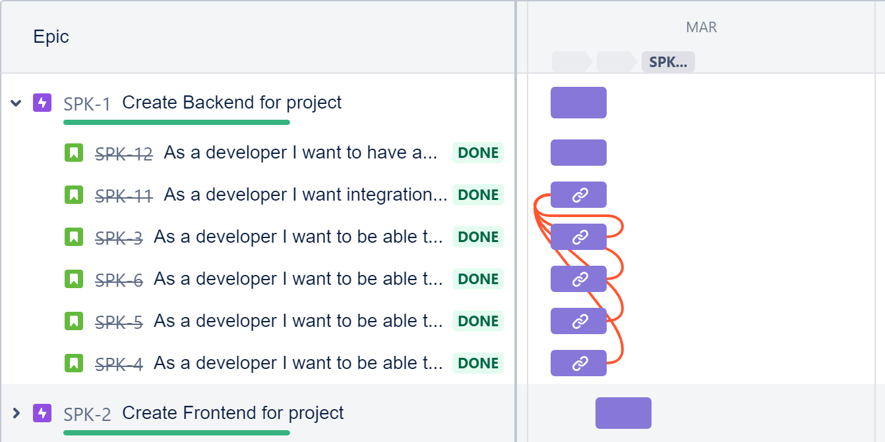

# Spring Project - Tyranids

## Introduction

The project specification was to create an application using all elements of our training, including:

* Project management
* Databases
* Java SE
* Spring Boot
* Front-End Development
* Automated Testing

## Planning Resources

I used Jira to create a Kanban board to plan my project. I organised it into two sprints, one each for the front back ends of my project with multiple user stories for each as can be seen below:

I also utilized git to maintain a feature branch model. Below is my network for the front end:

## Databases

I used two databases in my application, both in MySQL, one to use in testing the back end and the other to persist data from the program.

## Testing and Back End

My back end was builted using Spring Boot to connect to my database. I also created integration tests for the back end which used MockMVC to mock HTTP requests.

## Front End

I used HTML, CSS and JavaScript to create the front end for my application. HTML and CSS defined the appearance and JavaScript was used to connect to the back end.

